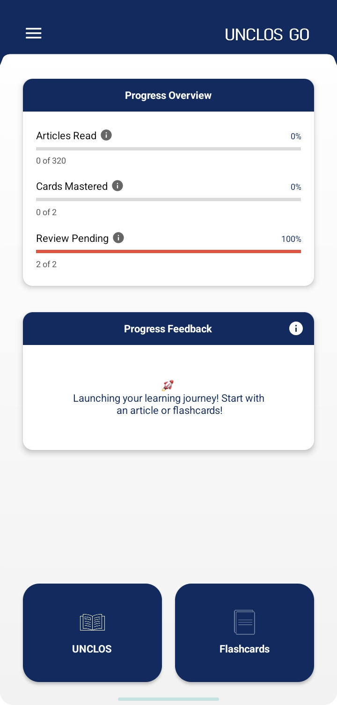
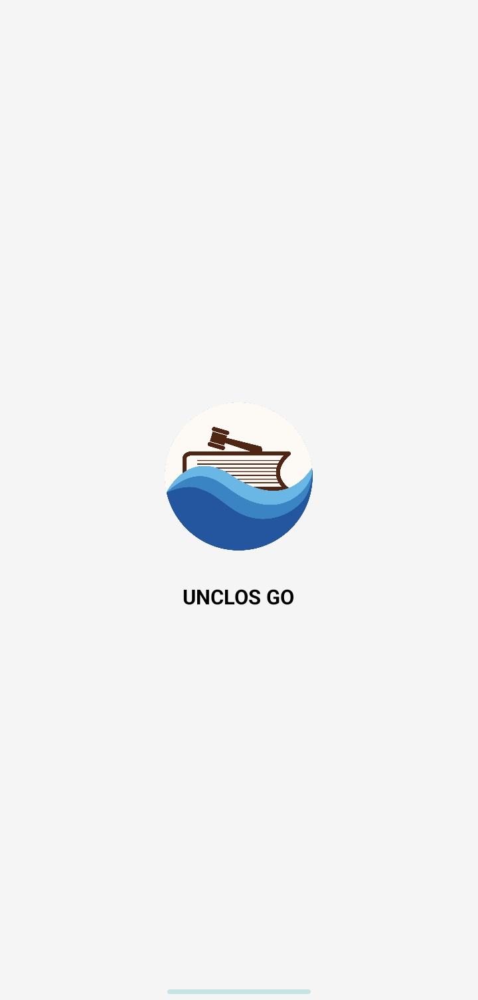
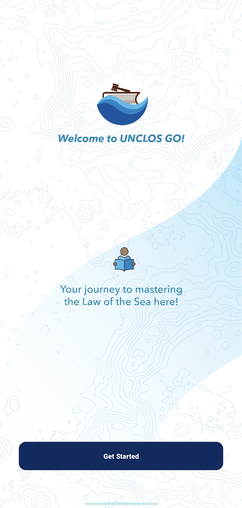
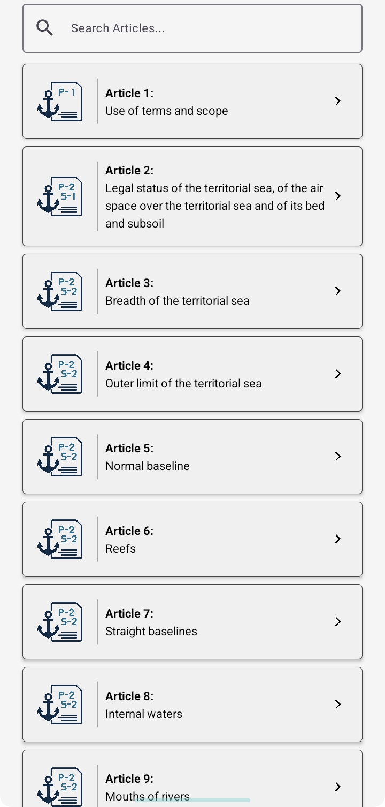
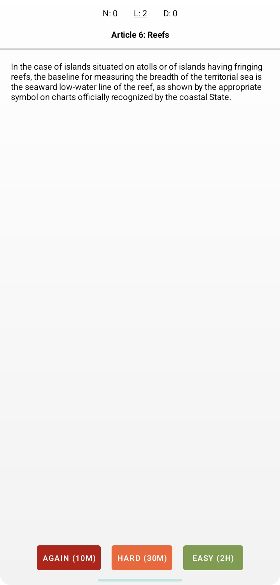
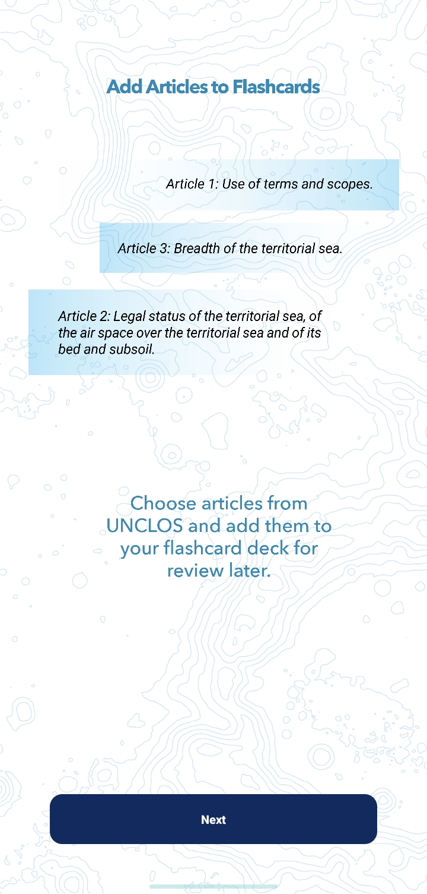
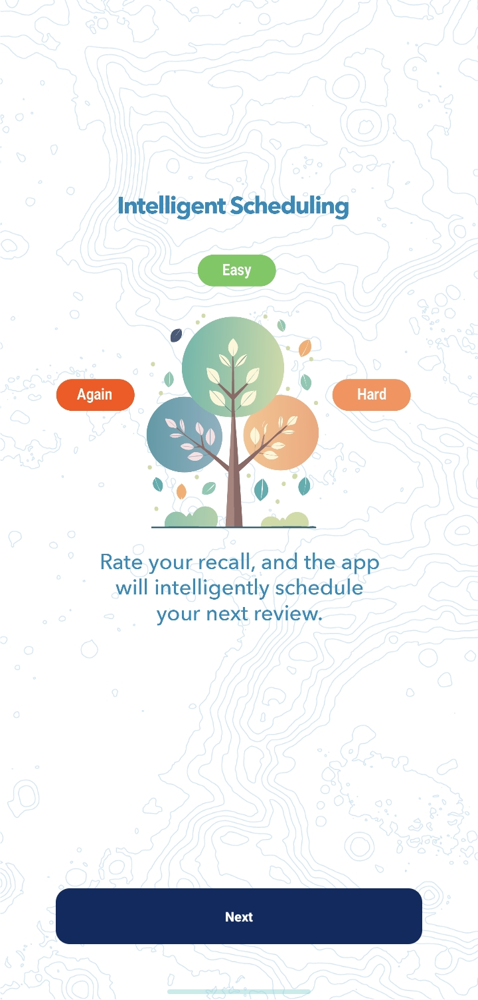
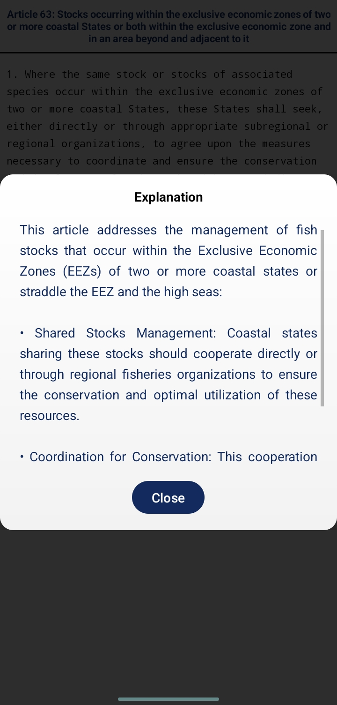
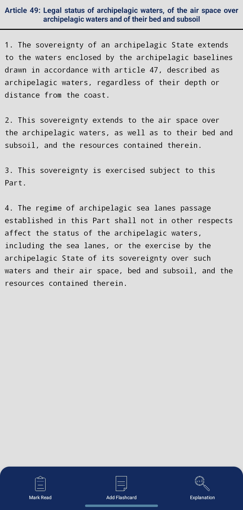
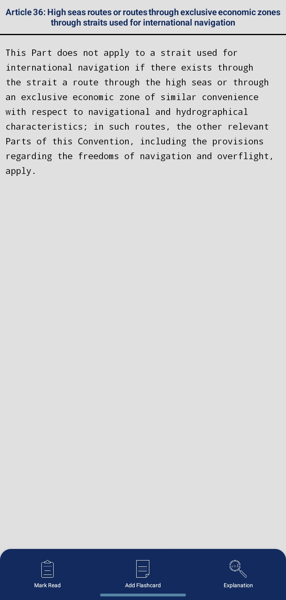

# Unclos go 🚀

Unclos go is an offline Android app of UNCLOS that provides 320 articles for reading and testing. It's lightweight, fast, and user-friendly.

## 📱 Features

- Welcome screen for 2 seconds.
- Read Mode: Browse and read 320 numbered articles.
- Mark articles as read and track your reading progress.
- Flashcard section using SRS for spaced revision.
- Smooth UI with a French blue theme.
- Built for API level 26 and above.

## 🛠️ Built With

- Java
- Android Studio
- XML Layout
- Local Data Storage (e.g., SQLite/SharedPreferences)

## 📷 Screenshots


### 🏠 Home Screen




### 📖 Read Mode


### 🧠 Flashcard Section


### 🧪 Instruction



###  📖Explanation


###  📖Sample Article



## 📦 Requirements

- Android Studio Dolphin or later
- Android SDK 26+
- Gradle

## 🚀 Getting Started

1. Clone the repo:
   ```bash
   git clone https://github.com/Tanvir-touhid/UNCLOS.GO.git
